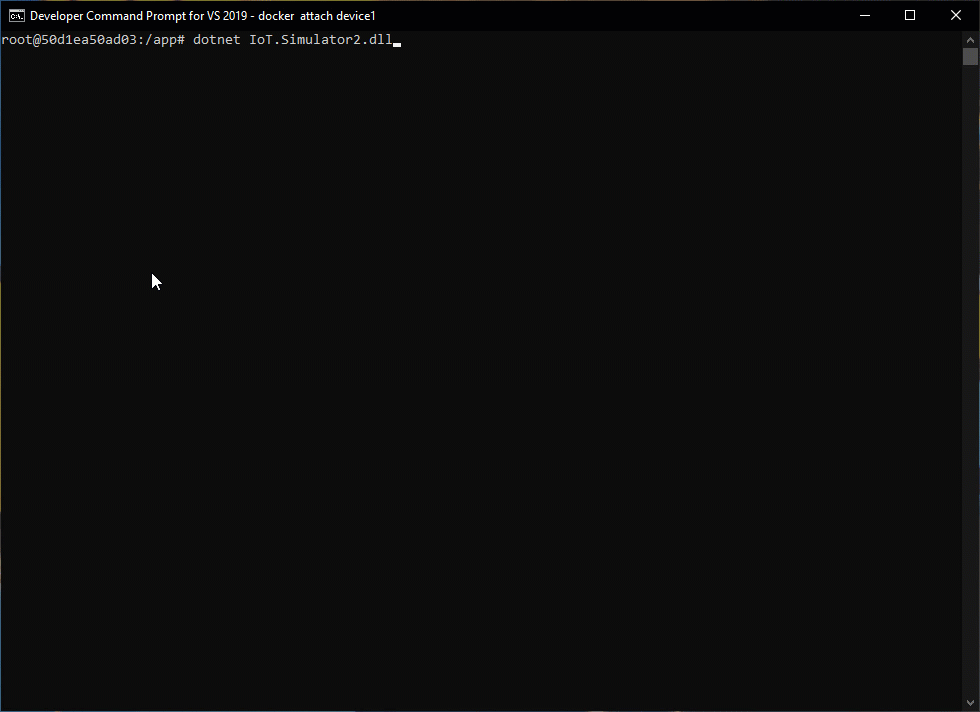

# Azure IoT Device Simulator - Readme

This project has for purpose to help IoT developers and testers. The solution is an Azure IoT Device simulator that implements different types of Cloud To Device (C2D) / Device To Cloud (D2C) flows between Microsoft IoT Hub and the simulated device.

For more details:
 - [*Detailled information*](sources/IoT.Simulator2/IoT.Simulator2/docs/Help.md)
 - [*How to*](sources/IoT.Simulator2/IoT.Simulator2/docs/HowTo.md)

Example of uses:
 - development tool for developers working in Microsoft Azure IoT solutions (cloud)
 - tester tool in IoT-oriented projects
 - scalable IoT simulation platforms
 - fast and simple development of IoT devices

Technical information:
 - .NET Core 2.x
 - Microsoft Azure IoT SDK (Device capabilities, including IoT Hub modules)

*Azure IoT Device Simulator logs*

## Global features
 - device simulation
 - module simulation
 - device simulation configuration (JSON-based)
 - oriented module oriented configuration (JSON-based)
 - no specific limitation in the number of modules (only limited by IoT Hub constraints)
 - containerizable
 - message templates based on JSON
 - implementation of full IoT flows (C2D, D2C, C2M, M2C)

## Functional features

### Device level (C2D/D2C)

*Commands*
 - Request latency test
 - reboot device
 - device On/Off
 - read device Twin
 - generic command (with JSON payload)
 - generic command
 - update telemetry interval
 
 *Messages*
 The device can send messages of different types (telemetry, error, commissioning).
 
 *Twin*
 Any change in the Desired properties is handled by the device.

### Module level (C2M/M2C)
The features at module level are the identical to the device features except the latency tests.

[details](sources/IoT.Simulator2/IoT.Simulator2/docs/Help.md).

  
## Global technical features

Functional features are based on these generic technical features:
 - telemetry sent from a device.
 - a device can contain one or many modules.
 - each module behaves independently with its own flows (C2M/M2C) and its configuration settings.
 - telemetry sent from a module.
 - messages received by a device.
 - messages received by a module.
 - commands received by a device.
 - commandes received by a module.
 - Twin Desired properties changed notification (for devices).
 - Twin Desired properties changed notification (for modules).

### D2C
#### Device level
 - IoT Messages
 - Twins (Reported)

#### Module level (M2C)
 - IoT Messages
 - Twins (Reported)

### C2D
#### Device level
 - Twins (Desired)
 - Twins (Tags)
 - Direct Methods
 - Messages

#### Module level (C2M)
 - Twins (Desired)
 - Twins (Tags)
 - Direct Methods
 - Messages

## More information

- Details about **HOW the solution WORKS** are provided in the [help](sources/IoT.Simulator2/IoT.Simulator2/docs/Help.md) section.
- Details about **HOW the solution can be USED** are provided in the [how to](sources/IoT.Simulator2/IoT.Simulator2/docs/HowTo.md) section.
