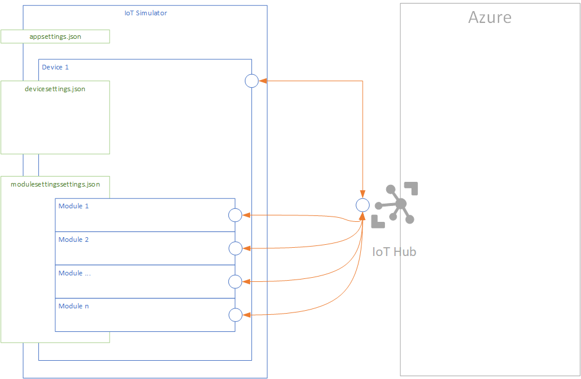

# Azure IoT Device Simulator - Help

This section describes the different artifacts of the solution and how they work.

As described in the [Readme](../../../../README.md) section, this application simulates different IoT use cases (D2C as well as C2D).

## Application
The application consist of:
 - an application console (.NET Core 2.2.x)
 - configuration files:
   - appsettings.json
   - devicesettings.json
   - modulessettings.json
 - message template files
   - commissioning.json
   - error.json
   - measureddata.json

*Global device model architecture*





## Features
### Device
#### D2C
##### Messages
1. [Commissioning](##Commissioning) messages
2. Measured data messages (aka telemetry)
3. Error messages (functional errors sent by devices)

##### Twins
The device sends updated Reported Properties (Twins) for many operations.

> [!NOTE]
> Example: after OnOff Direct Method requests, in order to notify the actual status.

#### C2D
##### Direct Methods

|Method name|Description|Request|Response|Comments|
|:-|:-|:-|:-|:-|
| SendLatencyTest | Allows to start a [latency](LatencyTests.md) test between the given device and the IoT Hub is registered in. | timestamp, request's date | <ul><li>message with [latency](LatencyTests.md) (string)</li><li> result code, 200</li></ul>|The request contains the initial request timpestamp. Indeed, the request parameter is an integer representing the timestamp of the request date. <br> Hence, the direct method handler can math the time elapsed between the request and the response.<br>***NOTE: it requires an [Azure Function](https://github.com/jonmikeli/azureiotdevicesimulator/tree/master/sources/IoT.Simulator2/IoT.Simulator2.AF) handling part of the process.***|
| Reboot | Simulates a device reboot operation. | NA | <ul><li>message notifiying that the reboot method has been called (string).</li><li> result code, 200</li></ul>|Sends Twins (Reported properties) notifying the reboot.|
| OnOff | Turns a given device on/off. | JSON Object | <ul><li>message notifiying that the reboot method has been called (string). The message contains request's payload.</li><li> result code, 200</li></ul>|
| ReadTwins | Orders a given device to read its Twin data. | NA | <ul><li>message notifiying that the method has been called (string).</li><li>result code, 400 (another code to illustrate different use cases).</li></ul>|
| GenericJToken | Generic method | JSON Token | <ul><li>message notifiying that the method has been called (string).</li><li> result code, 200</li></ul>|
| Generic | Generic method | string | <ul><li>message notifiying that the method has been called (string).</li><li> result code, 200</li></ul>|
| SetTelemetryInterval | Updates the time rate used to send telemetry data. | seconds (int) | <ul><li>message notifiying that the method has been called (string).</li><li> result code, 200</li></ul>|


##### Messages
The device can be configured to receive generic messages coming from the cloud (IoT Hub).

##### Twins
###### Desired
Any change in a Desired property (device level) is notified to the device and it can be handled.

###### Tags
Device Twin and inherently Tags can be read by the device.

### Modules

#### M2C
##### Messages
1. [Commissioning](##Commissioning) messages
2. Measured data messages (aka telemetry)
3. Error messages (functional errors sent by modules)

##### Twins
Modules send updated Reported Properties (Twin) for many operations.

> [!NOTE]
> Example: after OnOff Direct Method requests, in order to notify the actual status.

#### C2M
##### Direct Methods

|Method name |Description|Request|Response|Comments|
|:-|:-|:-|:-|:-|
| Reboot | Simulates a device reboot operation. | NA | <ul><li>message notifiying that the reboot method has been called (string).</li><li> result code, 200</li></ul>|Sends Twins (Reported properties) notifying the reboot.|
| OnOff | Turns a given device on/off. | JSON Object | <ul><li>message notifiying that the reboot method has been called (string). The message contains request's payload.</li><li> result code, 200</li></ul>|
| ReadTwins | Orders a given device to read its Twin data. | NA | <ul><li>message notifiying that the method has been called (string).</li><li>result code, 400 (another code to illustrate different use cases).</li></ul>|
| GenericJToken | Generic method | JSON Token | <ul><li>message notifiying that the method has been called (string).</li><li> result code, 200</li></ul>|
| Generic | Generic method | string | <ul><li>message notifiying that the method has been called (string).</li><li> result code, 200</li></ul>|
| SetTelemetryInterval | Updates the time rate used to send telemetry data. | seconds (int) | <ul><li>message notifiying that the method has been called (string).</li><li> result code, 200</li></ul>|


##### Messages
Each module can be configured to receive generic messages coming from the cloud (IoT Hub).

##### Twins
###### Desired
Any change in a Desired property (module level) is notified to the module and it can be handled.

###### Tags
Twins and inherently Tags can be read by the module.


## How does the simulator work?
### Description
The application is configurable by an ***appsettings.json*** file.

The features of the application rely on two main components:
 - device (**one single device per application**)
 - modules (**none, one or many modules per device**)
 
 The device component is configured by a ***devicesettings.json*** file while the modules are configured by a ***modulessettings.json*** file.

### Runing the simulator
 The simulator is a .NET Core application.
 
 To run the simulator, there are two alternatives:
  1. runing the simulator as a *.NET Core binary**
  1. runing the *Docker container* (which contains in turn the .NET Core binaries and other required prerequisites, see [Docker](https://www.docker.com) and container oriented development for those who are not familiar with)
 
 Whatever the alternative will be, check that the **3 configuration** files are set properly.
 
 #### Runing .NET Core application
 Run the command below:
 ```dotnet
 dotnet IoT.Simulator2.dll
 ```

 #### Runing Docker container
 ```cmd
 docker run -ti --name [containername] [imagename]
 ```

> [!IMPORTANT]
> The entrypoint of the container is the .NET Core application.
> So, no need to execute any dotnet command in order to start the simulator.

 You can get ready to use Docker images of the simulator from [this Docker repository](https://hub.docker.com/r/jonmikeli/azureiotdevicesimulator).


 ### Configurations
 #### Application
 Technical settings of the application can be configured at *appsettings.json*.

 > Example (Production environment):
 ```json
 {
  "Logging": {
    "LogLevel": {
      "Default": "Warning"
    }
  }
}
 ```

 >[!NOTE]
 >The solution contains different settings depending on the environment.

 >Example (Development environment):
  ```json
 {
  "Logging": {
    "Debug": {
      "LogLevel": {
        "Default": "Trace"
      }
    },
    "Console": {
      "IncludeScopes": true,
      "LogLevel": {
        "Default": "Trace"
      }
    },
    "LogLevel": {
      "Default": "Trace",
      "System": "Trace",
      "Microsoft": "Trace"
    }
  }
}
 ```

#### Device
IoT Simulator is linked to **one and only one** device.
The device behavior is configured by the *devicessettings.json* configuration file.

> Example:

```json
{
  "connectionString": "HostName=[IOTHUB NAME].azure-devices.net;DeviceId=[DEVICE ID];SharedAccessKey=[KEY]",
  "simulationSettings": {
    "enableLatencyTests": false,
    "latencyTestsFrecuency": 10,
    "enableDevice": true,
    "enableModules": true,
    "enableTelemetryMessages": false,
    "telemetryFrecuency": 60,
    "enableErrorMessages": false,
    "errorFrecuency": 60,
    "enableCommissioningMessages": false,
    "commissioningFrecuency": 60,
    "enableTwinReportedMessages": false,
    "twinReportedMessagesFrecuency": 60,
    "enableReadingTwinProperties": false,
    "enableC2DDirectMethods": true,
    "enableC2DMessages": true,
    "enableTwinPropertiesDesiredChangesNotifications": true
  }
}
```
Properties are quite self-explanatory.

> [!NOTE]
> Emission frequency rates are set in seconds.

#### Modules
IoT Simulator's device can contain **zero, one or more modules but no module is mandatory**.
Modules' behaviors are configured by the *modulessettings.json* configuration file.


> Example of a configuration file of two modules:
```json
{
 "modules":[
    {
      "connectionString": "HostName=[IOTHUB NAME].azure-devices.net;DeviceId=[DEVICE ID];ModuleId=[MODULE ID];SharedAccessKey=[KEY]",
      "simulationSettings": {
        "enableLatencyTests": false,
        "latencyTestsFrecuency": 10,
        "enableTelemetryMessages": false,
        "telemetryFrecuency": 60,
        "enableErrorMessages": false,
        "errorFrecuency": 60,
        "enableCommissioningMessages": false,
        "commissioningFrecuency": 60,
        "enableTwinReportedMessages": false,
        "twinReportedMessagesFrecuency": 60,
        "enableReadingTwinProperties": false,
        "enableC2DDirectMethods": true,
        "enableC2DMessages": true,
        "enableTwinPropertiesDesiredChangesNotifications": true
      }
    },
    {
      "connectionString": "HostName=[IOTHUB NAME].azure-devices.net;DeviceId=[DEVICE ID];ModuleId=[MODULE ID];SharedAccessKey=[KEY]",
      "simulationSettings": {
        "enableLatencyTests": false,
        "latencyTestsFrecuency": 10,
        "enableTelemetryMessages": false,
        "telemetryFrecuency": 60,
        "enableErrorMessages": false,
        "errorFrecuency": 60,
        "enableCommissioningMessages": false,
        "commissioningFrecuency": 60,
        "enableTwinReportedMessages": false,
        "twinReportedMessagesFrecuency": 60,
        "enableReadingTwinProperties": false,
        "enableC2DDirectMethods": true,
        "enableC2DMessages": true,
        "enableTwinPropertiesDesiredChangesNotifications": true
      }
    }
  ]
}
```

> [!NOTE]
> Emission frequency rates are set in seconds.


### Configuration files
#### appsettings.json
 ```json
 {
  "Logging": {
    "LogLevel": {
      "Default": "Warning"
    }
  }
}
 ```

#### devicesettings.json

```json
{
  "connectionString": "HostName=[IOTHUB NAME].azure-devices.net;DeviceId=[DEVICE ID];SharedAccessKey=[KEY]",
  "simulationSettings": {
    "enableLatencyTests": false,
    "latencyTestsFrecuency": 10,
    "enableDevice": true,
    "enableModules": true,
    "enableTelemetryMessages": false,
    "telemetryFrecuency": 60,
    "enableErrorMessages": false,
    "errorFrecuency": 60,
    "enableCommissioningMessages": false,
    "commissioningFrecuency": 60,
    "enableTwinReportedMessages": false,
    "twinReportedMessagesFrecuency": 60,
    "enableReadingTwinProperties": false,
    "enableC2DDirectMethods": true,
    "enableC2DMessages": true,
    "enableTwinPropertiesDesiredChangesNotifications": true
  }
}
```
Properties are quite self-explanatory.

> [!NOTE]
> Emission frequency rates are set in seconds.

#### modulessettings.json
```json
{
 "modules":[
    {
      "connectionString": "HostName=[IOTHUB NAME].azure-devices.net;DeviceId=[DEVICE ID];ModuleId=[MODULE ID];SharedAccessKey=[KEY]",
      "simulationSettings": {
        "enableLatencyTests": false,
        "latencyTestsFrecuency": 10,
        "enableTelemetryMessages": false,
        "telemetryFrecuency": 60,
        "enableErrorMessages": false,
        "errorFrecuency": 60,
        "enableCommissioningMessages": false,
        "commissioningFrecuency": 60,
        "enableTwinReportedMessages": false,
        "twinReportedMessagesFrecuency": 60,
        "enableReadingTwinProperties": false,
        "enableC2DDirectMethods": true,
        "enableC2DMessages": true,
        "enableTwinPropertiesDesiredChangesNotifications": true
      }
    },
    {
      "connectionString": "HostName=[IOTHUB NAME].azure-devices.net;DeviceId=[DEVICE ID];ModuleId=[MODULE ID];SharedAccessKey=[KEY]",
      "simulationSettings": {
        "enableLatencyTests": false,
        "latencyTestsFrecuency": 10,
        "enableTelemetryMessages": false,
        "telemetryFrecuency": 60,
        "enableErrorMessages": false,
        "errorFrecuency": 60,
        "enableCommissioningMessages": false,
        "commissioningFrecuency": 60,
        "enableTwinReportedMessages": false,
        "twinReportedMessagesFrecuency": 60,
        "enableReadingTwinProperties": false,
        "enableC2DDirectMethods": true,
        "enableC2DMessages": true,
        "enableTwinPropertiesDesiredChangesNotifications": true
      }
    }
  ]
}
```

> [!NOTE]
> Emission frequency rates are set in seconds.


### Messages

The messages below are basic common proposals allowing to start working. You will probably need to adjust them to each of your IoT projects according to your customers' requirements.

> [!TIP]
> `deviceId` and `messageType` fields have been included in the message to simplify processes in the backend side.
> Indeed, even though these two properties can be rechable with in the metadata of the message, having them inside the message allows different scenarios (ex: gateways sending messages in behalf of others) and storing that information in the repository (autosufficient message, which could be reached by backend processes but we saved them proceeding this way). 
> Debugging and message routings at IoT Hub level are other of the fields that benefit from this practice.

This being said, if at some point you need to avoid including that information in the message, feel free to do it. Routing could also work on metadata.

#### commissioning.json
```json
{
  "deviceId": "",
  "messageType": "commissioning",
  "timestamp": 13456,
  "userId": "",
  "building": {
    "buildingId": "",
    "floor": "",
    "departmentId": "",
    "roomId": null
  }
} 
```

> [!WARNING]
> No moduleId is required since commissioning is related to devices.


#### error.json
```json
{
  "deviceId": "",
  "moduleId": "",
  "messageType": "error",
  "errorCode": "code",
  "errorSeverity": "severity",
  "errorStatus": "status",
  "timestamp": 13456
}
```

> [!WARNING]
> moduleId can be empty in case the message is sent by a device.

#### measureddata.json

We consider each item (device or module) can send many "measured data" in a single message.
This responds to data flow optimization scenarios.

```json
{
  "deviceId": "",
  "moduleId": "",
  "timestamp": 0,
  "schemaVersion": "v1.0",
  "messageType": "data",
  "data": [
    {
      "timestamp": 0,
      "propertyName": "P1",
      "propertyValue": 35,
      "propertyUnit": "T",
      "propertyDivFactor": 1
    },
    {
      "timestamp": 0,
      "propertyName": "P2",
      "propertyValue": 1566,
      "propertyUnit": "U",
      "propertyDivFactor": 10
    }
  ]
}
```

> [!WARNING]
> moduleId can be empty in case the message is sent by a device.

## Evolutivity

If you have the source code of the solution (open sourcing the project is being discussed at the moment this documentation is being written), you can follow the steps below to customize how messages are created.

Message generation relies on services that implement the interfaces below:
 - `ITelemetryMessageService` for telemetry or measured data
 - `IErrorMessageService`
 - `ICommissioningMessageService`

If you need richer business logic or more evolved dynamic ways to generate messages, you can easily use your own implementation of these interfaces and update the IoC/DI.

The method that registers services is located in the `Program.cs` class:
```csharp
RegisterMessagingServices
```

Replace the lines below with your own implementation:
```csharp
services.AddTransient<ITelemetryMessageService, SimpleTelemetryMessageService>();
services.AddTransient<IErrorMessageService, SimpleErrorMessageService>();       
services.AddTransient<ICommissioningMessageService, SimpleCommissioningMessageService>();
```

# Lexique
A few meanings in the context of this document.

## Commissioning

Commissioning represents the act of linking a provisioned device and a user (or user related information).

## Provisioning

Provisioning represents the action of creating an identity for the device in the IoT Hub.

## Azure IoT related vocabulary

## Twin
[Device twins](https://docs.microsoft.com/en-us/azure/iot-hub/iot-hub-devguide-device-twins) store device state information including metadata, configurations, and conditions. Azure IoT Hub maintains a device twin for each device that you connect to IoT Hub.

Similarly, [module twins](https://docs.microsoft.com/en-us/azure/iot-hub/iot-hub-devguide-module-twins) play the same role thant device twins but at module level.

Twins contain 3 main sections:
 - Tags
 - Properties (Desired)
 - Properties (Reported)

For more details, follow the links provided.

## Tags
A section of the JSON document that the solution back end can read from and write to. Tags are not visible to device apps.

## Twin Desired properties
Used along with reported properties to synchronize device configuration or conditions. The solution back end can set desired properties, and the device app can read them. The device app can also receive notifications of changes in the desired properties.

## Twin Reported properties
Used along with desired properties to synchronize device configuration or conditions. The device app can set reported properties, and the solution back end can read and query them.

